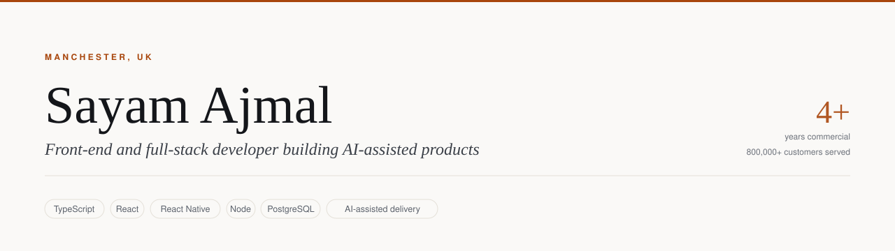

<picture>
  <source media="(prefers-color-scheme: dark)" srcset="assets/banner-dark.svg">
  
</picture>

Four years delivering digital products in regulated environments — Tata
Consultancy Services and Plusnet, on products serving 800,000+ customers — and
a habit of building things end to end on my own time.

I like the unglamorous parts: what happens when the signal drops, what happens
when two people press the same button, and what happens when someone pulls your
app apart to see what's inside.

  <a href="https://sayamdev.github.io/cv/"><picture><source media="(prefers-color-scheme: dark)" srcset="assets/link-cv-dark.svg"></picture></a>
  <a href="mailto:asfcit15sayamajmal@gmail.com"><picture><source media="(prefers-color-scheme: dark)" srcset="assets/link-email-dark.svg"></picture></a>
  <a href="https://linkedin.com/in/sayam-ajmal"><picture><source media="(prefers-color-scheme: dark)" srcset="assets/link-linkedin-dark.svg"></picture></a>
  <a href="https://github.com/SayamDev?tab=repositories"><picture><source media="(prefers-color-scheme: dark)" srcset="assets/link-github-dark.svg"></picture></a>

---

## Relay — an AI assistant for business operations

Enquiries and complaints arrive; Relay reads them, decides what they are and how
urgent, extracts the commercial detail, opens the follow-up task and drafts the
reply — then stops and waits for a person. Every decision is written to an audit
trail.

**[▶ Try the demo](https://sayamdev.github.io/relay/)** · **[Source](https://github.com/SayamDev/relay)**

Runs on a deterministic rules engine so the public demo costs nothing to host,
with the same interface driving a local model through Ollama and the same
workflows executing in n8n.

The part I'd point at in an interview: I ran a real model against it and caught
it rewriting *"revenue fell, driven by lead volume"* into *"driven by a decrease
in conversion rate, as the conversion rate increased"* — a claim that
contradicted the evidence table rendered directly beneath it. So I took the
model out of that path entirely and put guards on the rest, and the reasons are
written down in the repo. Knowing when **not** to use the model is most of the
work.

---

## TurfXI — an app for running a Sunday-league football team

Fixtures, live match events, player ratings, subs collection. Offline-first, so
it works on a pitch with no signal. React Native on iOS and Android, Postgres
on Supabase.

**[▶ Try the demo](https://sayamdev.github.io/turfxi-demo/)** · **[Case study](https://github.com/SayamDev/turfxi-demo)**

No sign-up — it loads a club with a full season already played.

While building it I found a hole that let any club member make themselves an
admin of their club. Fixed it in the database policy where a modified app can't
reach it, then wrote a test that signs in as two real users and proves it's
closed. That test found a second bug: it had been reading its config from the
wrong directory since the day it was written, so it had never actually run.

---

## ATC Aptitude Drills

Free, open practice for the aptitude tests used to select trainee air traffic
controllers. Explains the format, teaches a method, and shows where you're
losing marks. Runs entirely in the browser.

**[Source](https://github.com/SayamDev/atc-aptitude-drills)**

---

## Skills

<!-- SKILLS:START -->

<picture>
  <source media="(prefers-color-scheme: dark)" srcset="assets/skills-dark.svg">
  
</picture>

Generated from [my CV data](https://github.com/SayamDev/cv/blob/main/src/data/cv.ts) on 2026-09-10 — I edit one file and this panel redraws itself.

<!-- SKILLS:END -->

Previously worked with

 

`.NET` · `C#` · `VB.NET` · `Angular` · `WordPress` · `Java` · `PHP` · `MongoDB`

Still readable, still useful in a code review — just not what I reach for now.

---

**How this page maintains itself:** my CV lives in one typed file in the
[`cv`](https://github.com/SayamDev/cv) repository. That repository publishes
itself as JSON, and a scheduled workflow here fetches it and redraws the skills
panel above in both light and dark. I update one file; the CV site and this
profile follow. No badge service is involved — every image on this page is
generated in the repository and served from it.

---

Open to work in technical delivery, development, data or digital transformation.
The quickest way to see how I build is the Relay demo above — it covers the
architecture, the guardrails and the reasoning behind both.
