<picture>
  <source media="(prefers-color-scheme: dark)" srcset="assets/banner-dark.svg">
  
</picture>

Four years delivering digital products in regulated environments — Tata
Consultancy Services and Plusnet, on products serving 800,000+ customers — and
a habit of building things end to end on my own time.

I like the unglamorous parts: what happens when the signal drops, what happens
when two people press the same button, and what happens when someone pulls your
app apart to see what's inside.

  <a href="https://sayamdev.github.io/cv/"><picture><source media="(prefers-color-scheme: dark)" srcset="assets/link-cv-dark.svg"></picture></a>
  <a href="mailto:asfcit15sayamajmal@gmail.com"><picture><source media="(prefers-color-scheme: dark)" srcset="assets/link-email-dark.svg"></picture></a>
  <a href="https://linkedin.com/in/sayam-ajmal"><picture><source media="(prefers-color-scheme: dark)" srcset="assets/link-linkedin-dark.svg"></picture></a>
  <a href="https://github.com/SayamDev?tab=repositories"><picture><source media="(prefers-color-scheme: dark)" srcset="assets/link-github-dark.svg"></picture></a>

---

## Selected work

<table>
<tr><td width="46%" valign="top">

<a href="https://oruk-navigator.vercel.app">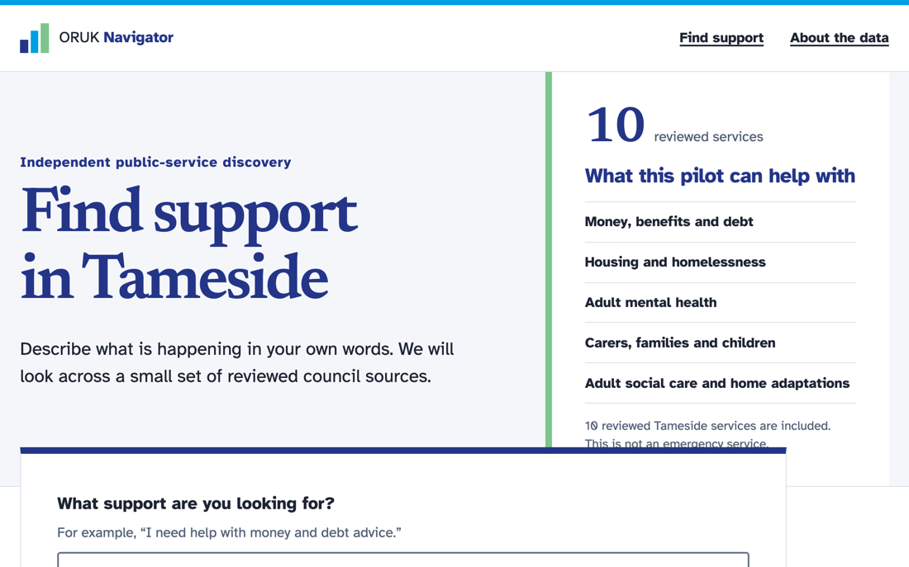</a>

</td><td valign="top">

### ORUK Navigator — council pages, published as data

Ask for help in Tameside and the answer is spread across council pages you would
have to know to look for. Navigator lets you describe what is wrong in your own
words, shows what might help and why it matched, and links to the council's own
page so you can check it yourself.

Behind it, the same reviewed information is published in the open format councils
use to share service data, so nobody has to copy it out by hand. A C# tool
alongside it checks any council's feed and reports what is missing — pointed at
two live ones, it found records nobody had checked in over a year.

**[▶ Try it](https://oruk-navigator.vercel.app)** · **[The feed](https://oruk-navigator.vercel.app/api/oruk/v3)** · **[Source](https://github.com/SayamDev/ORUK-Navigator)**

<picture><source media="(prefers-color-scheme: dark)" srcset="assets/tags-oruk-dark.svg">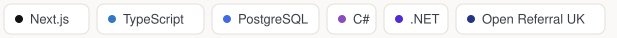</picture>

</td></tr>
</table>

> **Where I drew the line.** The search covers ten services, and it would have
> been easy to fill it out with another council's feed — thousands of records,
> instantly. I did not, because reading someone else's feed is allowed and
> republishing their records is not, and nobody had granted that. So the other
> feeds appear as a report on what they publish, with a test that proves not one
> of their records survives into my pages. A smaller catalogue I can defend beats
> a large one I cannot.

 

<table>
<tr><td width="46%" valign="top">

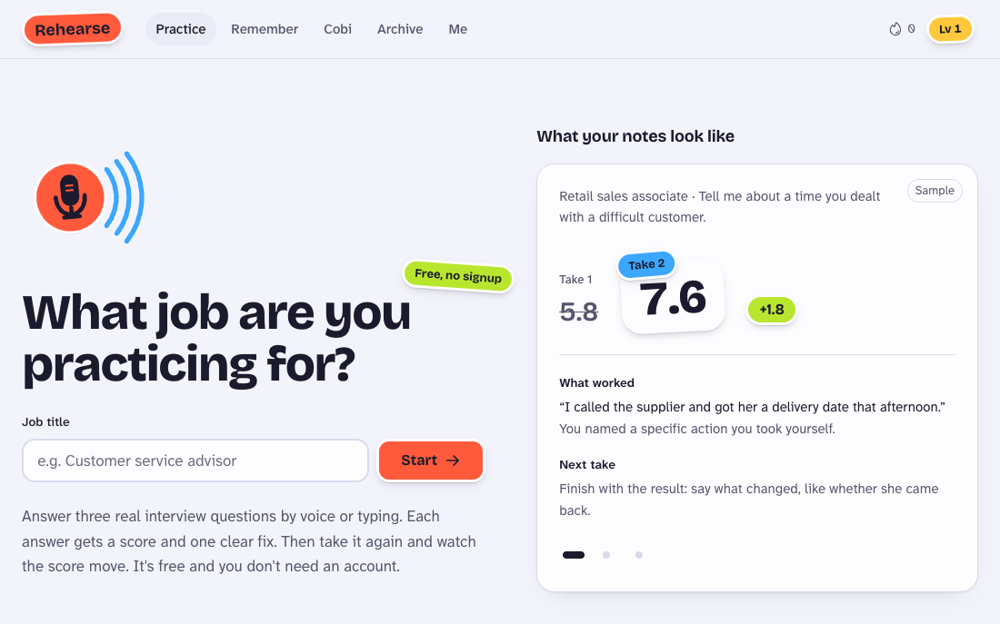

</td><td valign="top">

### Rehearse — interview practice that talks back

For people who never get coached before an interview: school leavers, career
changers, anyone with a gap or a record they are dreading being asked about. You
answer out loud, get a score and one thing to fix, then take it again and watch
the number move.

There is a hands-free mode where the interviewer listens, reacts to what you
actually said and asks a follow-up, and checks in if you go quiet. Guides cover
the hard parts: a gap, being fired, a disability, a conviction.

It costs nothing to run. The notes come from a free AI tier, the voice runs in
the visitor's browser, and when the free allowance runs out it switches to
built-in notes instead of a paywall.

<picture><source media="(prefers-color-scheme: dark)" srcset="assets/tags-rehearse-dark.svg">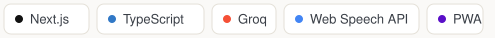</picture>

</td></tr>
</table>

> **The provider I turned down.** One AI provider's free tier would have been
> the easiest to wire up. Its terms let it keep and review what people type, and
> it is for over-18s only. This app is meant for teenagers too, and people type
> things into it they would not say out loud. So it runs on a provider that
> keeps nothing by default, and the code caps its own usage just under the free
> limit, so it stays free even if the account were ever upgraded.

 

<table>
<tr><td width="46%" valign="top">

<a href="https://sayamdev.github.io/revamp/">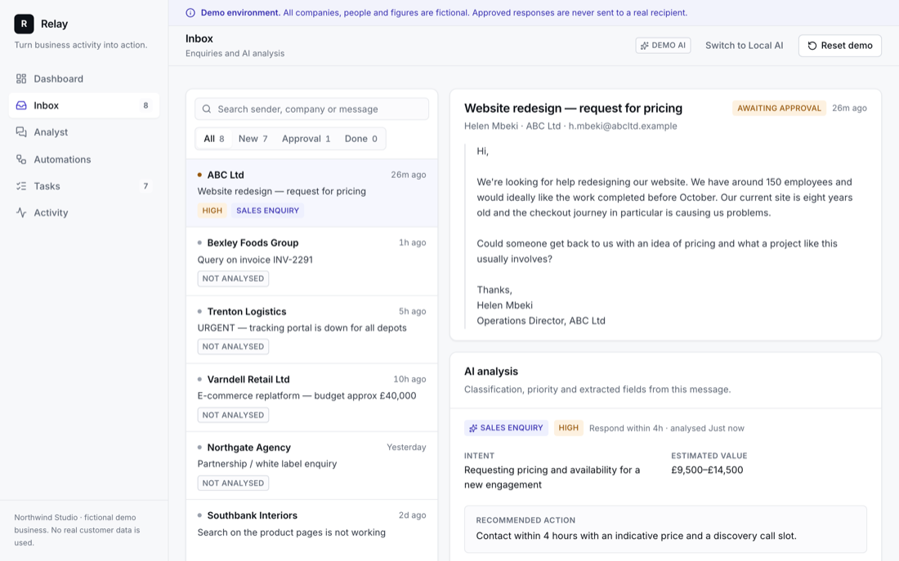</a>

</td><td valign="top">

### Revamp — AI for business operations

Enquiries and complaints arrive; Revamp reads them, decides what they are and how
urgent, extracts the commercial detail, opens the follow-up task and drafts the
reply — then stops and waits for a person. Every decision lands in an audit trail.

Runs on a deterministic rules engine, so the public demo costs nothing to host.
The same interface drives a local model through Ollama, and the same workflows
execute in n8n.

**[▶ Try the demo](https://sayamdev.github.io/revamp/)** · **[Source](https://github.com/SayamDev/revamp)**

<picture><source media="(prefers-color-scheme: dark)" srcset="assets/tags-revamp-dark.svg">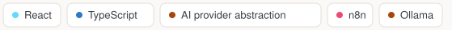</picture>

</td></tr>
</table>

> **The bit I'd point at in an interview.** I ran a real model against it and
> caught it rewriting *"revenue fell, driven by lead volume"* into *"driven by a
> decrease in conversion rate, as the conversion rate increased"* — a claim that
> contradicted the evidence table rendered directly beneath it. So I took the
> model out of that path entirely, put validation on the rest, and wrote down
> why. Knowing when **not** to use the model is most of the work.

 

<table>
<tr><td width="46%" valign="top">

<a href="https://sayamdev.github.io/turfxi-demo/">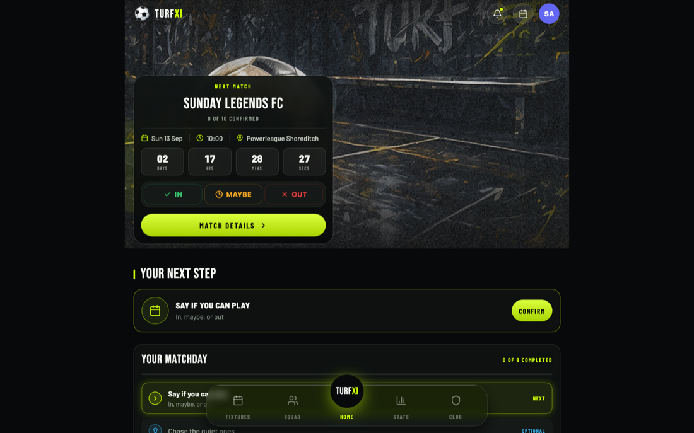</a>

</td><td valign="top">

### TurfXI — running a Sunday-league team

Fixtures, live match events, player ratings, subs collection. Offline-first, so
it works on a pitch with no signal. React Native on iOS and Android, Postgres on
Supabase.

No sign-up — the demo loads a club with a full season already played.

**[▶ Try the demo](https://sayamdev.github.io/turfxi-demo/)** · **[Case study](https://github.com/SayamDev/turfxi-demo)**

<picture><source media="(prefers-color-scheme: dark)" srcset="assets/tags-turfxi-dark.svg">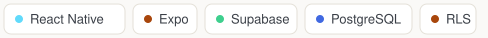</picture>

</td></tr>
</table>

> **What I found while building it.** A hole that let any club member make
> themselves an admin of their club. I fixed it in the database policy, where a
> modified app can't reach it, then wrote a test that signs in as two real users
> and proves it's closed. That test found a second bug: it had been reading its
> config from the wrong directory since the day it was written, so it had never
> actually run.

 

<table>
<tr><td width="46%" valign="top">

</td><td valign="top">

### Bubiqo — the useful parts of the page you are on

A Chrome side panel that reads whatever page you have open and pulls out the
parts you would otherwise go hunting for.

- **Job adverts** — pay, closing date, contract, location, the requirements, and
  any condition the advert sets: DBS, clearance, right to work, each quoted from
  the text.
- **Emails** — the deadline, what was asked of you, what you promised.
- **Invoices** — supplier, total, reference, due date.
- **Anything carrying a date** — bookings, renewals, appointments, tickets.

It then offers to save it, copy it, set a reminder, or make a calendar file. It
never sends, submits, posts or pays, and it cannot read a page you have not
opened it on.

Nothing leaves the device: no host permissions at install, no content scripts,
one network call in the whole codebase, and no model anywhere near the reading —
which is what lets 477 tests hold the behaviour in place.

**[Source](https://github.com/SayamDev/bubiqo)** · **[How it reads a page](https://github.com/SayamDev/bubiqo/blob/main/docs/adr/0002-deterministic-core.md)**

<picture><source media="(prefers-color-scheme: dark)" srcset="assets/tags-bubiqo-dark.svg">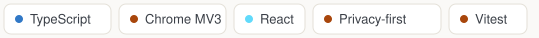</picture>

</td></tr>
</table>

> **The line I had to delete.** It used to say *"Ruled out"* when an advert asked
> for a DBS check. That is the product claiming to know something about the
> reader from evidence that is only about the advert — you might hold one, or
> get one in a fortnight. It was ruling people out of jobs nobody had ruled them
> out of. Conditions are now stated as what the advert asks, with a button that
> says *I have this*, and the answer is remembered.

 

<table>
<tr><td width="46%" valign="top">

<a href="https://sayamdev.github.io/setoffiq/">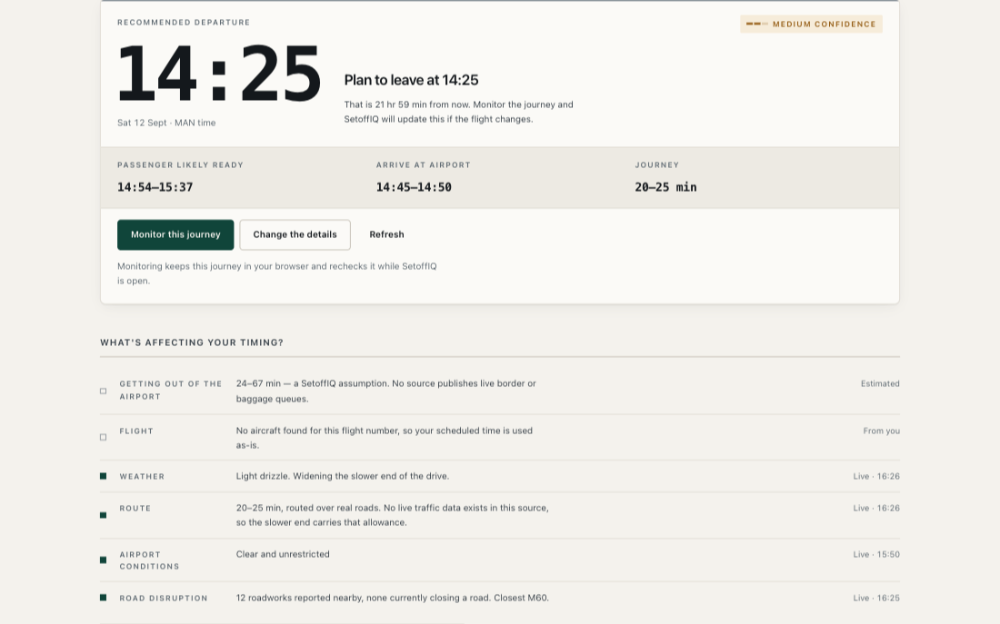</a>

</td><td valign="top">

### SetoffIQ — when to leave for the airport

Picking someone up or dropping them off at Manchester: it works back from the
flight — landing, border, bags, the walk out — to the time you should leave
home. Live aircraft positions refine the time from your booking; when nothing
live is available, it says so instead of guessing.

Costs nothing to run or to use. A scheduled GitHub Action publishes the data a
browser can't fetch directly, and no credential ever reaches the page.

**[▶ Try it](https://sayamdev.github.io/setoffiq/)** · **[Source](https://github.com/SayamDev/setoffiq)**

<picture><source media="(prefers-color-scheme: dark)" srcset="assets/tags-setoffiq-dark.svg">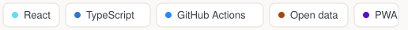</picture>

</td></tr>
</table>

> **What real data taught me.** The first live run of the road-closures feed
> returned 24 disruptions near the airport — every one a routine lane closure
> for maintenance. Letting those widen the estimate would have put a permanent
> 6–12% penalty on every recommendation, and a warning that is always on is not
> a warning. Now only closures actually in force move the number; the rest are
> reported, not counted.

 

<table>
<tr><td width="46%" valign="top">

<a href="https://sayamdev.github.io/atc-aptitude-drills/">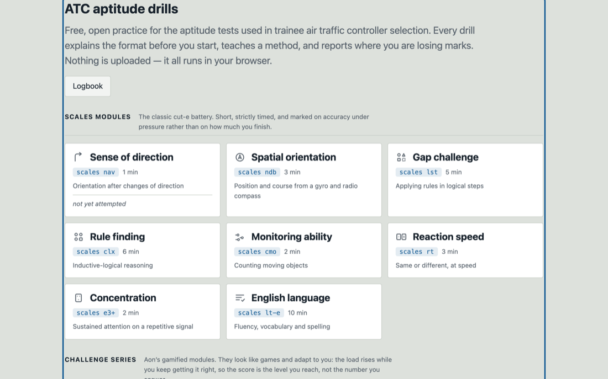</a>

</td><td valign="top">

### ATC Aptitude Drills

Free, open practice for the aptitude tests used to select trainee air traffic
controllers. Every drill explains the format before you start, teaches a method,
and reports where you're losing marks.

Nothing is uploaded — it all runs in the browser.

**[▶ Try it](https://sayamdev.github.io/atc-aptitude-drills/)** · **[Source](https://github.com/SayamDev/atc-aptitude-drills)**

<picture><source media="(prefers-color-scheme: dark)" srcset="assets/tags-atc-dark.svg">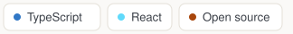</picture>

</td></tr>
</table>

---

## Skills

<!-- SKILLS:START -->

<picture>
  <source media="(prefers-color-scheme: dark)" srcset="assets/skills-dark.svg">
  
</picture>

Generated from [my CV data](https://github.com/SayamDev/cv/blob/main/src/data/cv.ts) on 2026-09-24 — I edit one file and this panel redraws itself.

<!-- SKILLS:END -->

Previously worked with

 

`.NET` · `C#` · `VB.NET` · `Angular` · `WordPress` · `Java` · `PHP` · `MongoDB`

Still readable, still useful in a code review — just not what I reach for now.

---

**How this page maintains itself:** my CV lives in one typed file in the
[`cv`](https://github.com/SayamDev/cv) repository. That repository publishes
itself as JSON, and a scheduled workflow here fetches it and redraws the skills
panel above in both light and dark. I update one file; the CV site and this
profile follow. No badge service is involved — every image on this page is
generated in the repository and served from it.

---

Open to work in technical delivery, development, data or digital transformation.
The quickest way to see how I build is the Revamp demo above — it covers the
architecture, the guardrails and the reasoning behind both.
